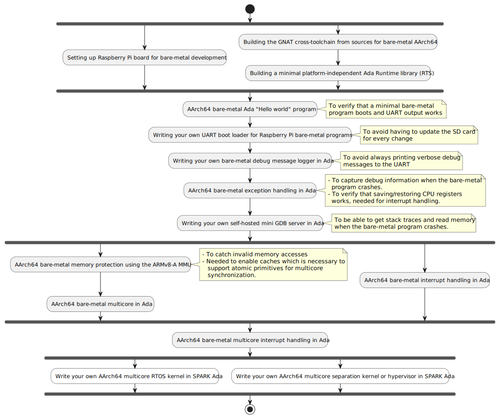
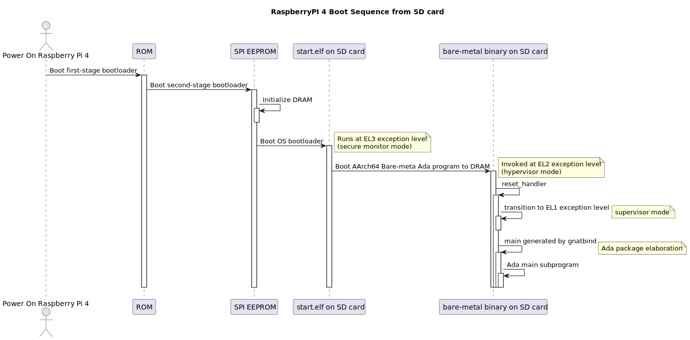
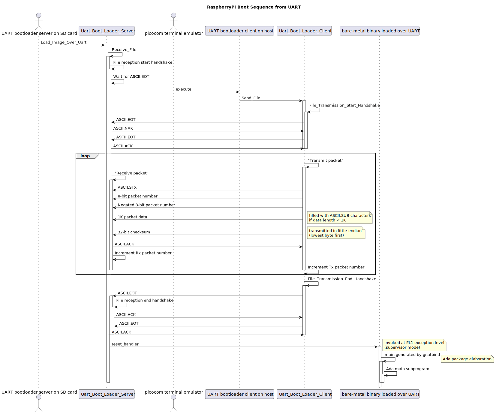
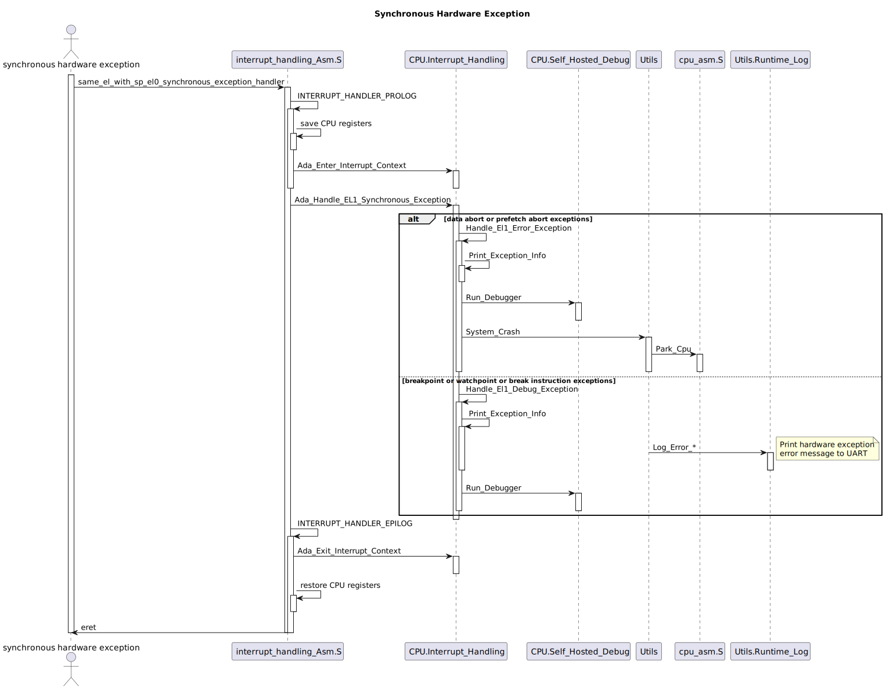
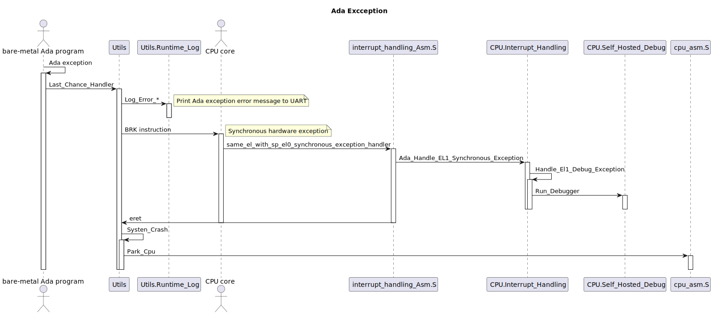
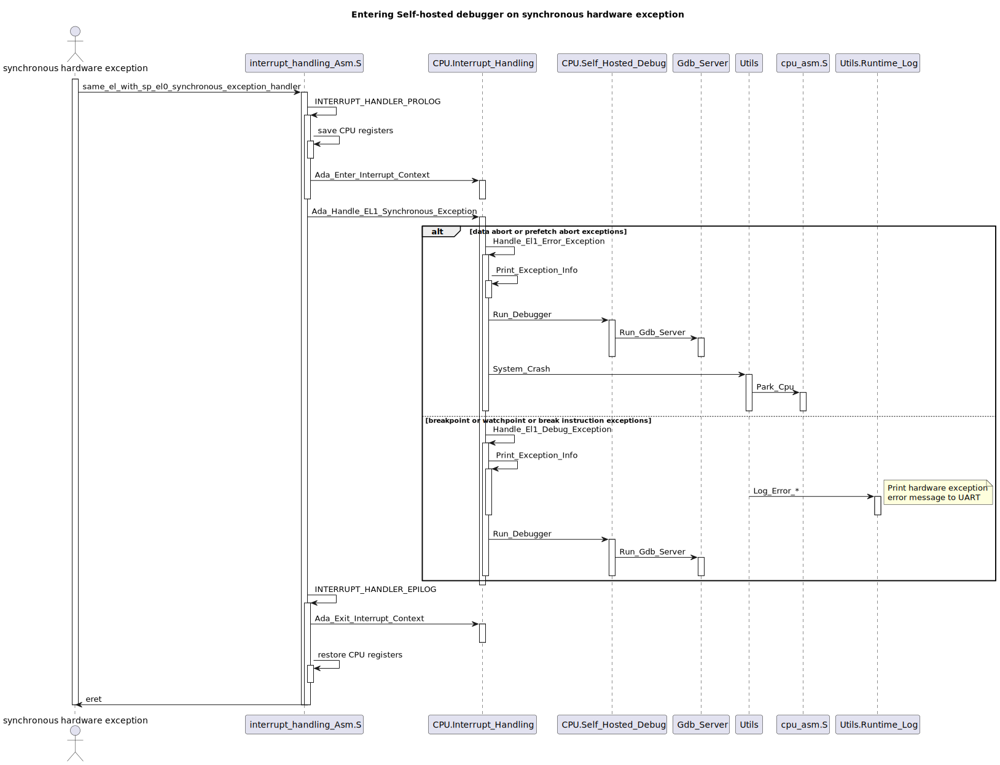
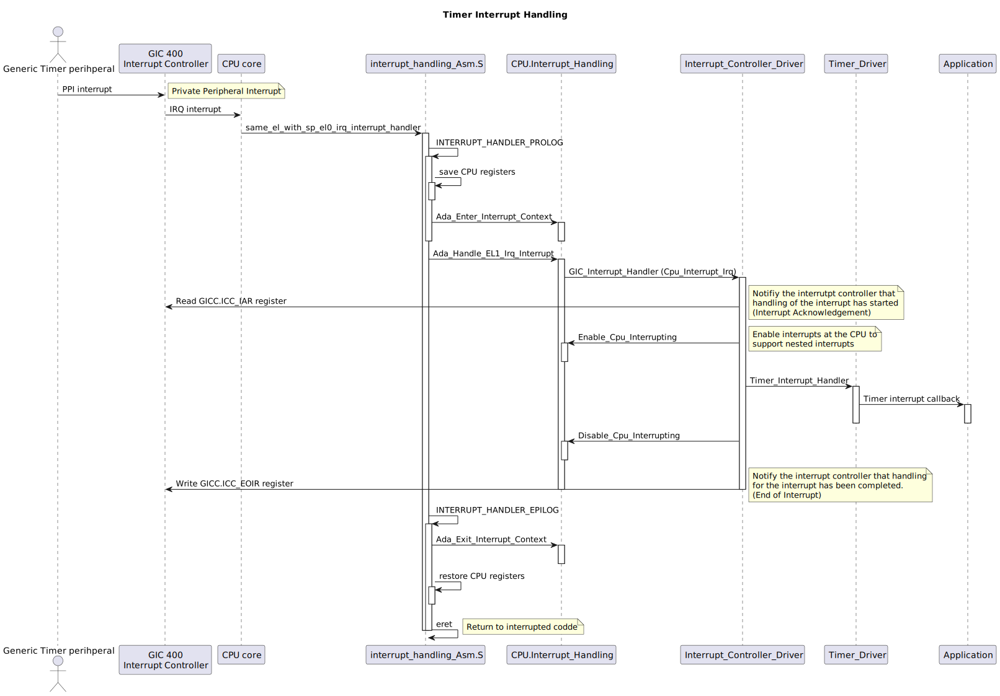
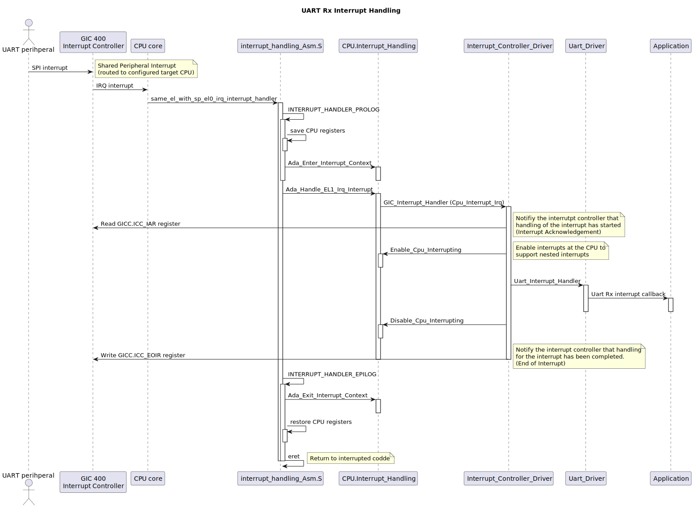

# Developing Bare-metal Embedded Software in SPARK Ada for 64-bit ARM Platforms
*J. German Rivera*<br>
jgrivera67@gmail.com

This tutorial teaches how to develop 64-bit bare-metal embedded software for the
64-bit ARMv8-A (AArch64) architecture in SPARK Ada.
The tutorial develops from scratch a collection of bare-metal SPARK Ada software
components that can be used as an infrastructure to develop multicore system-level
software in Ada, for AArch64-based embedded platforms.
They can be used as a foundation to develop boot ROMs, bootloaders, multicore RTOS
kernels, separation kernels and hypervisors in Ada, for AArch64-based platforms.
The Raspberry Pi 4 and Raspberry Pi 5 boards are used as the target platforms.

This is a hands-on tutorial and to get the most out of it, attendees are encouraged
to bring their own Raspberry Pi 4 or Raspberry Pi 5 boards, a microSD card already
formatted with Raspbian, a development laptop (preferably running Linux or
MacOS) with a microSD card reader, and a USB-to-serial cable to connect the
laptop to the Raspberry Pi's UART0 serial port.

Below is the road map of this tutorial. The end goal is to teach everything
necessary to enable you to develop your own RTOS kernel or your own separation
kernel or hypervisor for AArch64 platforms.



- [Setting up the development host environment](#section_1)
- [Setting up Raspberry Pi board for bare-metal development](#section_2)
- [Building the GNAT cross-toolchain from sources for bare-metal AArch64 (aarch64-elf-gnat)](#section_3)
- [Minimal platform-independent bare-metal Ada Runtime library (RTS)](#section_4)
- [AArch64 bare-metal Ada "Hello World" program](#section_5):
  - Raspberry Pi boot sequence
  - AArch64 startup code
  - Minimal UART driver
- [Writing your own UART bootloader for Raspberry Pi bare-metal programs](#section_6)
- [Writing your own bare-metal debug message logger in Ada](#section_7)
- [AArch64 bare-metal exception handling in Ada](#section_8)
- [Writing your own self-hosted mini GDB server in Ada](#section_9)
- [AArch64 bare-metal memory protection using the ARMv8-A MMU](#section_10)
- [AArch64 bare-metal interrupt handling in Ada](#section_11)
  - GICv2 interrupt controller (GIC-400)
  - ARMv8 generic timer interrupt (PPI interrupt)
  - UART Rx interrupt (SPI interrupt)
- [AArch64 bare-metal multicore in Ada](#section_12)
  - Bare-metal multicore boot in Ada
  - Spinlocks
- [AArch64 bare-metal multicore interrupt handling in Ada](#section_13)
- [Writing your own multicore RTOS for AArch64](#section_14)

<a id="section_1"></a>
## Setting up your development host environment

### Prerequisites
- Install the [Alire](https://alire.ada.dev) Ada package manager
- Install the [VS Code](https://code.visualstudio.com) IDE
- Install the picocom terminal emulator:
  - On MacOS: `brew install picocom`
  - On Ubuntu: `sudo apt install picocom`
- Install ser2net (only needed on MacOS)
  - On MacOS: `brew install ser2net`

### Setting up your development host for accessing the Raspberry Pi debug UART

- For Raspberry Pi 4, use a USB to TTL serial cable such as [this one](https://www.adafruit.com/product/954)
  - Connect the cable to the Raspberry PI board shown below (the red wire is not necessary):
    

  - Install the corresponding device driver for the serial to USB cable, for
    your development host. For example, for
    the PL2303TA USB to TTL Serial Cable, for MacOS, download and install [this driver](https://www.prolific.com.tw/us/showproduct.aspx?p_id=229&pcid=41).
    For Linux, The PL2303 driver is in the mainline Linux kernel.

- For Raspberry Pi 5, use the Raspberry Pi [Debug Probe](https://www.raspberrypi.com/documentation/microcontrollers/debug-probe.html) like [this one](https://www.adafruit.com/product/5699)
  - Connect the cable to the Raspberry PI board shown below (the red wire is not necessary):
    

### How to run picocom to access Raspberry Pi debug UART
```
picocom -b 115200 --send-cmd="<aarch64_bare_metal_ada dir>/host_apps/uart_boot_loader_client/bin/uart_boot_loader_client" \
                     --noreset <tty port>
```
Example for Raspberry Pi 4:
```
picocom -b 115200 --send-cmd="./host_apps/uart_boot_loader_client/bin/uart_boot_loader_client" \
     --noreset /dev/tty.usbserial-0001
```
Example for Raspberry Pi 5:
```
picocom -b 115200 --send-cmd="./host_apps/uart_boot_loader_client/bin/uart_boot_loader_client" \
      --noreset /dev/tty.usbmodem12202
```

### How to run ser2net to forward Raspberry Pi UART to a TCP port (only needed on MacOS)
NOTE: This is apparently necessary on MacOS to use remote gdb to connect to the
Raspberry Pi UART.

```
/opt/homebrew/sbin/ser2net -n -d -l -c <aarch64_bare_metal_ada dir>/ser2net.yaml -P /tmp/ser2net.pid &
```

### How to run GDB client to connect to Raspberry PI over UART

Example for Raspberry Pi 5 on MacOS:
```
 aarch64-elf-gdb \
        --eval-command="target remote localhost:28880" \
        --eval-command="set output-radix 16" \
        --eval-command="set print address on" \
        --eval-command="set print array on" \
        --eval-command="set print pretty on" \
        --eval-command="set print union on" \
        --eval-command="set history save on" \
        --eval-command="set pagination off" \
        <AArch64 bare-metal ELF file>
```

<a id="section_2"></a>
## Setting up Raspberry Pi board for bare-metal development
- Install Raspberry Pi OS (64-bit) on a blank SD card using the Raspberry Pi Imager
  [tool](https://www.raspberrypi.com/software/)

### Preparing the Raspberry Pi SD card

- Mount the formatted SD card on your development host
- Make sure 64-bit mode is enabled in `config.txt` on the SD card:
  ```
  # Run in 64-bit mode
  arm_64bit=1
  ```
- For Raspberry Pi 4, add the following to `config.txt` on the SD card:
  ```
  [all]
  enable_uart=1
  core_freq_min=500
  dtoverlay=disable-bt
  uart_2ndstage=1
  kernel=aarch64_hello_ada.bin
  #kernel=uart_boot_loader_server.bin
  ```
- For Raspberry Pi 5, add the following to `config.txt` on the SD card:
  ```
  [all]
  enable_uart=1
  dtparam=uart0=on
  uart_2ndstage=1
  kernel=aarch64_hello_ada.bin
  #kernel=uart_boot_loader_server.bin
  kernel_address=0x80000
  #armstub=bl31.bin
  ```

<a id="section_3"></a>
## Building the GNAT cross-toolchain for bare-metal AArch64 (aarch64-elf-gnat)

### Download Sources
- Download latest binutils sources: https://www.gnu.org/software/binutils or https://ftp.gnu.org/gnu/binutils
- Download latest gcc sources: https://www.gnu.org/software/gcc or https://ftp.gnu.org/gnu/gcc
- Download latest gdb sources: https://www.gnu.org/software/gdb or https://ftp.gnu.org/gnu/gdb

### Building on MacOS
  Use script [build_aarch64_elf_gnat_toolchain_on_macos.sh](../third_party/build_aarch64_elf_gnat_toolchain_on_macos.sh).

  NOTE: If the build fails with the default native gcc compiler, try [gcc-14.2.0-3-aarch64-apple-darwin23](https://github.com/simonjwright/distributing-gcc/releases/download/gcc-14.2.0-3-aarch64/gcc-14.2.0-3-aarch64-apple-darwin23.pkg)

### Building on Ubuntu:
Use script [build_aarch64_elf_gnat_toolchain_on_ubuntu.sh](../third_party/build_aarch64_elf_gnat_toolchain_on_ubuntu.sh)

A recent native gnat compiler is needed to build the cross-compiler. One way to get one is through
the `alr toolchain --select` command. This command installs gnat compilers at `~/.local/share/alire/toolchains/gnat_native_*

### NOTE:
- These build scripts are based on the build procedure described in https://wiki.osdev.org/GNAT_Cross-Compiler, adapted for AArch64.
- For both MacOS and Linux, update the following shell variables in the build scripts,
  as needed, to match the versions of the toolchain sources to use:
  - `binutils_version=2.44`
  - `gcc_version=14.3.0`
  - `gdb_version=16.3`

- After building the cross-toolchain, make sure to prepend the following path to your `PATH` environment variable.
  ```
  ~/opt/cross/aarch64-elf/bin
  ```
  Alternatively, you can source the `dev_env.sh` script:
  ```
  . dev_env.sh
  ```
  This script also provides the following convenience functions:
  - `my_uart`: to invoke `picocom`
  - `my_gdb`: to invoke `aarch64-elf-gdb`

- To verify that the built cross-toolchain works correctly, build the included AArch64 bare-metal applications
by running the `build_all.sh` script.

<a id="section_4"></a>
## Minimal bare-metal platform-independent Ada runtime library (RTS)

See VS Code code tour 2.

<a id="section_5"></a>
## AArch64 bare-metal Ada "Hello World" program

### Booting a 64-bit bare-metal program on the Raspberry Pi

The boot sequence for the Raspberry Pi 4 is shown below:


The boot sequence for the Raspberry Pi 5 is shown below:


The last boot stage typically boots a Linux kernel binary image from the SD card,
but it can also boot a bare-metal program binary image (`.bin` file) instead. We
just need to copy the bare-metal binary image file to the SD card and add or change
the following line in the `config.txt` file on the SD card:

```
kernel=<bare-metal .bin file>
```

For example on MacOS, the SD card is mounted as `/Volumes/bootfs`. So,
we can copy our binary to the SD card as follows:
```
cp $bin_file /Volumes/bootfs
sync
```

See VS Code code tour 3.

<a id="section_6"></a>
## Writing your own UART bootloader for Raspberry Pi bare-metal programs




See VS Code code tour 4.

<a id="section_7"></a>
## Writing your own bare-metal debug message logger in Ada


See VS Code code tour 5.

<a id="section_8"></a>
## AArch64 bare-metal exception handling in Ada

- An AArch64 CPU core can run in one of 4 exception levels (modes):
  - EL3 - secure monitor mode (initial mode at machine boot time: ROM, EEPROM - second stage boot loder, BL31 - ARM Trusted Firmware)
  - EL2 - hypervisor mode (Rapberry Pi bare-metal programs are booted in this mode)
  - EL1 - supervisor mode (OS kernel mode, bare-metal programs in privileged mode)
  - EL0 - user mode (unprivileged mode)

- Each exception level has its own stack pointer, which is accessed via the SP banked register.
- When the CPU is running at EL1, EL2 or EL3, it can use the EL0 stack pointer or its own ELx stack pointer. (We use the EL0 SP)
- When the CPU is running at EL0, it can only use the EL0 stack pointer

The structure of the AArch64 interrupt vector table is shown below:


Below is a sequence diagram showing the execution
path of a synchronous hardware exception:



Below is a sequence diagram depicting the code
path that is executed for Ada software exception. The `Last_Chance_Handler` global Ada exception handler executes a break instruction to trigger
a synchronous exception. Uon return from the
exception, it parks CPU.



See VS Code code tour 6.

<a id="section_9"></a>
## Writing your own self-hosted mini GDB server in Ada

The self-hosted debugger gets executed when a synchronous hardware exception
is triggered by a CPU core. The self-hosted debugger runs a GDB server,
as shown below:



The GDB Remote Seral Protocol (RSP) is a request/response ASCII-based protocol used
to communicate a GDB client (e.g., command-line gdb, VS Code gdb GUI, ddd GUI)
running on a development host (e.g., Linux, MacOS or Windows)
with a GDB server (also known as gdb stub) running on the target platform
being debugged.


 The request/response packet formats of the GDB remote serial protocol are
 described at
  https://sourceware.org/gdb/onlinedocs/gdb/Packets.html.

See VS Code code tour 7.

<a id="section_10"></a>
## AArch64 bare-metal memory protection using the ARMv8-A MMU

Memory Access when the MMU and caches are enabled:


MMU Translation Tables


Virtual-Address to Physical-Address Identity Mapping:


Memory access sequence from a load instruction


See VS Code code tour 8.

<a id="section_11"></a>
## AArch64 bare-metal interrupt handling in Ada

- Private Peripheral (PPI) Interrupt handling


- Shared Peripherla (SPI) Interrupt handling


See VS Code code tour 9.

<a id="section_12"></a>
## AArch64 bare-metal multicore in Ada

See VS Code code tour A.

<a id="section_13"></a>
## AArch64 bare-metal multicore interrupt handling in Ada

See VS Code code tour B.

<a id="section_14"></a>
## Writing your own multicore RTOS for AArch64
Using the collection of bare-metal SPARK Ada software components presented in this tuotrial you can write your
own multicore RTOS for AArch64 in SPARK Ada. This is left
as an exercise for the reader. An example of a design of a
simple RTOS that could be implemented is described by
this [TLA+ model](https://github.com/jgrivera67/HiRTOS/blob/main/doc/tla_model/HiRTOS.pdf).